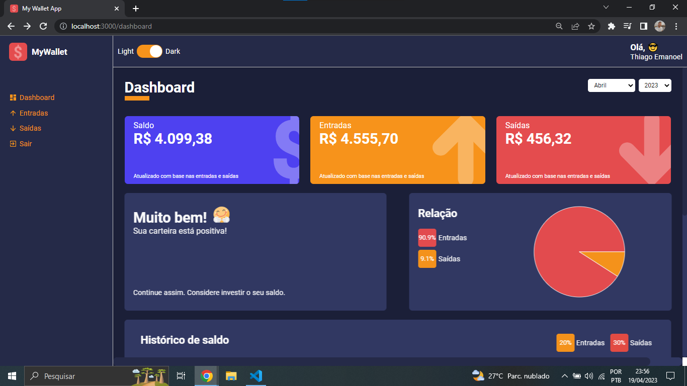
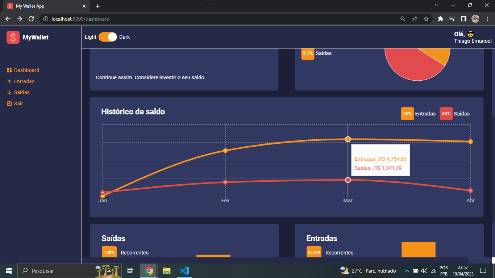
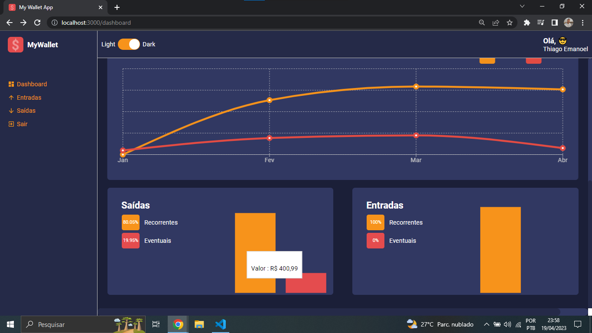
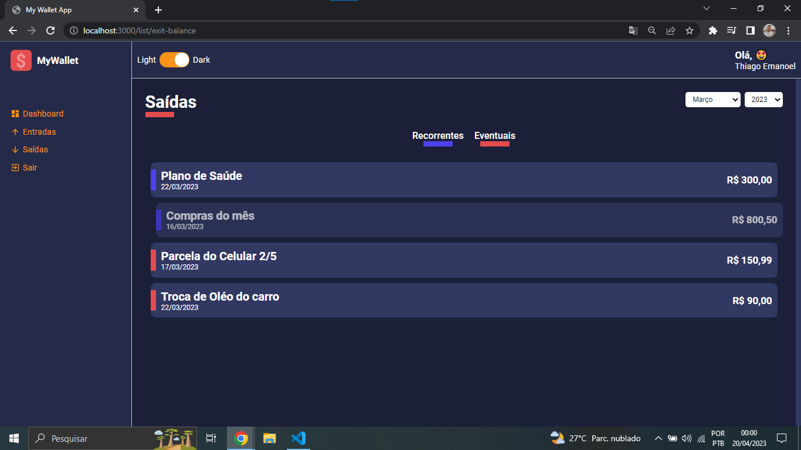

# My-Wallet :bar_chart:	:chart_with_downwards_trend:	

O projeto consiste na criação de um Dashboard para acompanhamento de gastos utilizando React JS e TypeScript. O objetivo é fornecer aos usuários uma interface intuitiva e clara para visualizar e analisar seus gastos. O uso do TypeScript ajuda a detectar erros de código em tempo de compilação, aumentando a qualidade e segurança do projeto.
<br/>

## Screenshots
<br/>
<p align="center">
    
    
    
    
</p>


## Instalação

Clone o projeto e acesse a sua pasta: 

```sh
$ git https://github.com/thiagoemanoel98/my-wallet-dashboard.git
$ cd my-wallet-dashboard
```

Instale as dependências do projeto e inicie:

```sh
# Dependências
$ yarn

# Iniciando...
$ yarn start 
```

Made with :coffee: by Thiago Emanoel :v:
